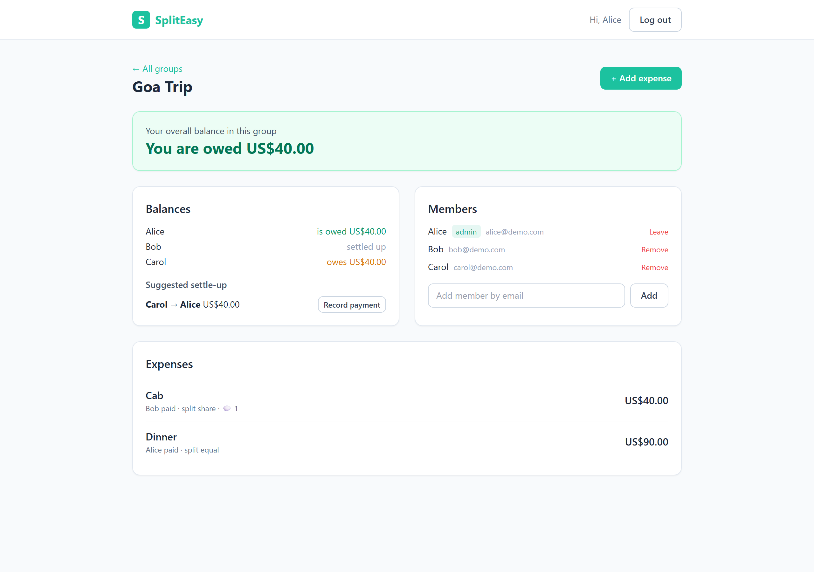
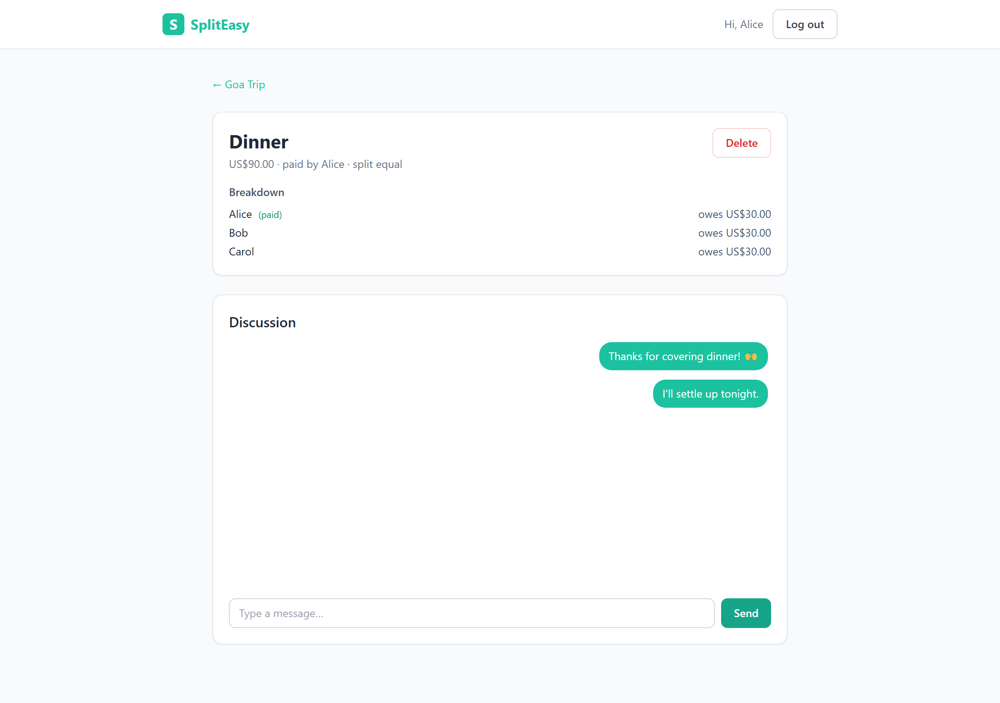
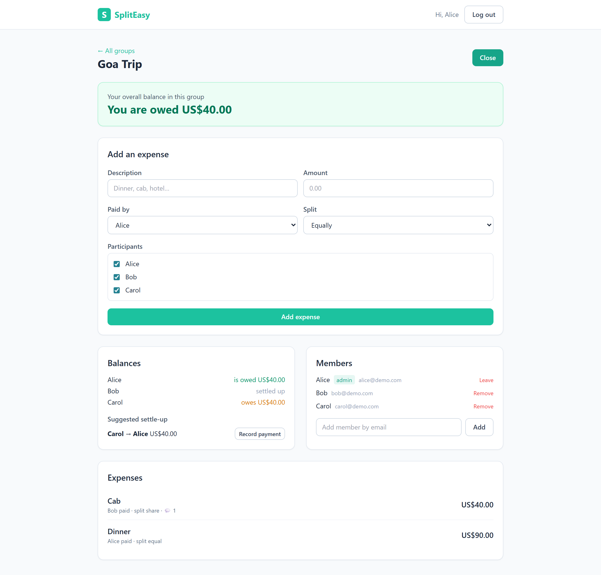
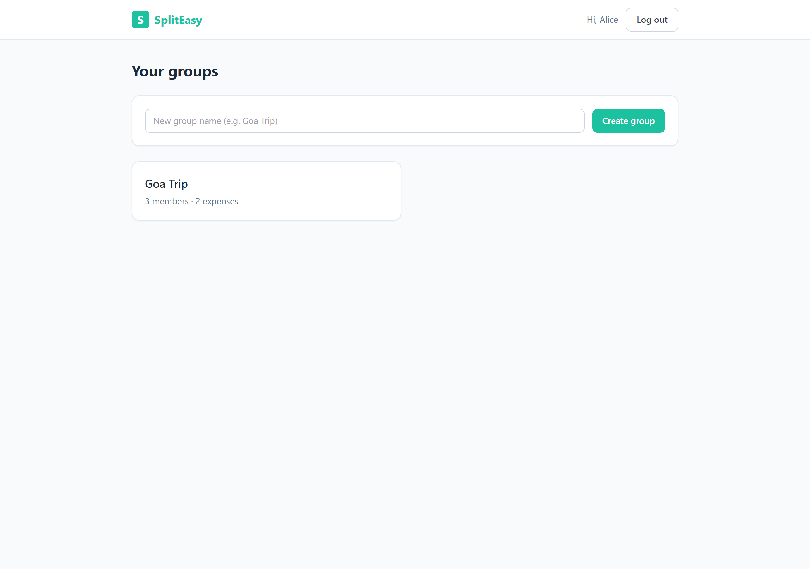

# SplitEasy

SplitEasy is a small Splitwise-style app for sharing expenses in a group. You make a
group, add expenses, pick how each one is split, chat about it, and the app keeps track
of who owes whom so you can settle up.

Live app: https://spliteasy-xi.vercel.app
Code: https://github.com/Ajayendra2705/spliteasy

You can log in with the demo account `alice@demo.com` / `password123` to look around.
The demo group already has a few members and expenses. Bob and Carol (`bob@demo.com`,
`carol@demo.com`) use the same password if you want to test with more than one person.

There are three other docs worth reading: `AI_CONTEXT.md` has the full technical
detail, `BUILD_PLAN.md` explains how I approached it, and `PROMPTS.md` has the prompts
I used while building it with an AI assistant.

## Screenshots

| Group page | Expense + chat |
|---|---|
|  |  |
| Add expense (with live preview) | Dashboard |
|  |  |

## What it does

- Sign up and log in with email and password.
- Create groups, rename them, add or invite members by email, remove members or leave.
  If you invite someone who doesn't have an account yet, they get a pending invite and
  join automatically when they sign up.
- Add, edit and delete expenses. Each expense can be split four ways: equally,
  unequally (exact amounts), by percentage, or by shares (like 2:1:1).
- Chat on each expense. New messages show up in real time using server-sent events.
- See balances for the whole group and your own "you owe / you're owed" summary, plus
  a suggested set of payments to settle everyone up with as few transfers as possible.
- Record payments between members to settle debts.

A couple of things I cared about while building it: all the money math is done in
integer cents so the splits always add up to the exact total (100 split three ways
comes out to 33.34 / 33.33 / 33.33, not 99.99), and balances are never stored in the
database. They're calculated from the expenses and settlements every time, so they
can't drift out of sync.

## Tech stack

- Next.js 14 (App Router) with TypeScript for both the UI and the API routes
- React 18 and Tailwind CSS
- PostgreSQL (hosted on Neon) with Prisma as the ORM
- Auth is email/password with bcrypt, and a JWT kept in an httpOnly cookie
- Zod for validating API input
- Server-sent events for the real-time chat
- Deployed on Vercel, with GitHub Actions running the checks

The app was built with an AI coding assistant acting as a junior engineer. It
interviewed me first, kept `AI_CONTEXT.md` up to date as we went, and wrote the code
based on my decisions. The prompts are in `PROMPTS.md`.

## Running it locally

You'll need Node 18 or newer and a Postgres database. The quickest way to get a
database is Docker:

```bash
docker run -d --name spliteasy-pg \
  -e POSTGRES_PASSWORD=postgres -e POSTGRES_DB=spliteasy \
  -p 5432:5432 postgres:16-alpine
```

Then:

```bash
npm install
cp .env.example .env      # set DATABASE_URL and JWT_SECRET
npm run db:push           # create the tables
npm run db:seed           # optional, adds the demo data
npm run dev               # http://localhost:3000
```

Other scripts:

- `npm run build` - production build
- `npm start` - run the production build
- `npm run db:studio` - browse the database in Prisma Studio
- `npm test` - run the split/balance math tests (no database needed)

## Deploying

It runs on Vercel with a Neon Postgres database that I added through the Vercel
marketplace (that sets `DATABASE_URL` for you). To put it somewhere yourself:

1. Push the repo to GitHub and import it into Vercel.
2. Add a Postgres database anywhere (Neon, Supabase, Render, Railway) and set
   `DATABASE_URL`.
3. Set `JWT_SECRET` to a long random string.
4. Run `npx prisma db push` once against that database to create the tables.
5. Deploy.

The Vercel project is connected to the GitHub repo, so pushing to `main` deploys to
production and pull requests get their own preview URL. GitHub Actions
(`.github/workflows/ci.yml`) type-checks, runs the tests and builds on every push.

## How the code is laid out

```
prisma/
  schema.prisma     the database models
  seed.ts           demo data
src/
  app/
    api/            the API routes (auth, groups, members, invitations,
                    expenses, balances, settlements, messages)
    login, signup   auth pages
    dashboard       list of your groups
    groups/[id]     a group: balances, members, expenses, settle up
    expenses/[id]   one expense plus its chat
  components/        the React components
  lib/
    prisma.ts       the Prisma client
    auth.ts         password hashing, JWT, the session cookie
    groups.ts       the "are you a member" check
    splits.ts       the split calculations
    balances.ts     balances and debt simplification
    http.ts         turns errors into clean JSON responses
    client.ts       a small fetch helper for the browser
scripts/test-logic.ts   the math tests
```

## Testing

There's a small test file (`scripts/test-logic.ts`) that checks all four split types
add up correctly, that bad input is rejected, and that balances and settlements come
out right. Beyond that I ran the whole API end to end with curl against a real
database (both locally and against the live deployment) - signing up, the four splits,
chat, balances, settling, and the member/invite rules. CI runs the type check, the
tests and a build on every push.

## What's not there

It's a single currency (shown as USD). Invites are created in the app rather than
emailed out (no email is actually sent, but the invite is real and gets accepted when
the person signs up). There's no password reset, and no pagination, but nothing in the
app needs it at this size. The rest of the trade-offs are written up in `AI_CONTEXT.md`.
